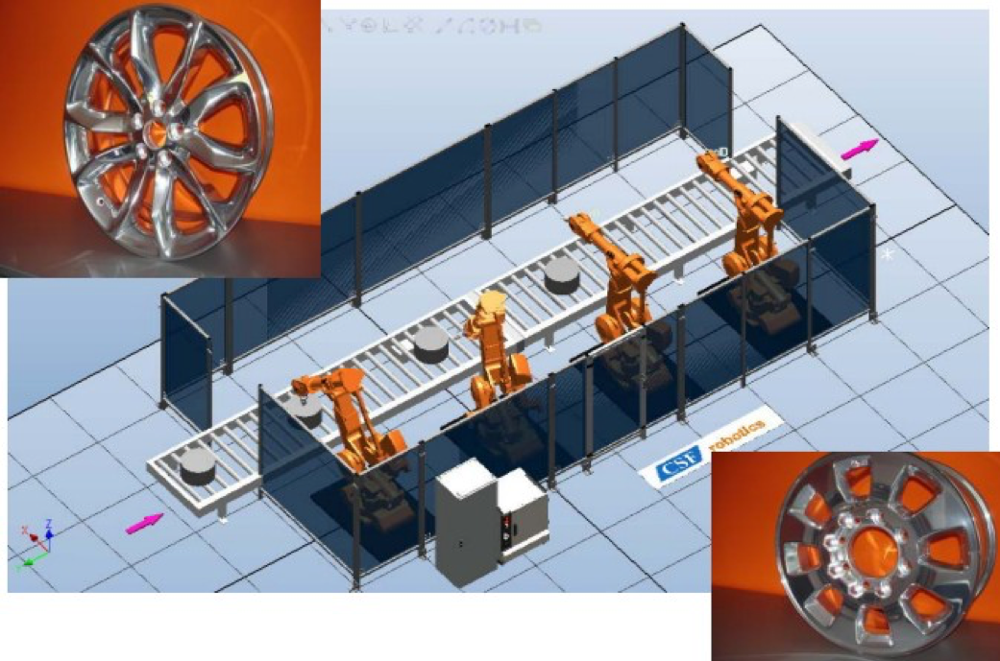

# 关键工艺

打磨机器人系统由工业机器人、打磨机具、力控制设备、终端执行器等外围设备硬件系统和机器人力矩等软件系统组成。打磨机器人的自动化系统集成，就是将组成打磨机器人的各种软硬件系统集成为相互关联，统一协调总控制系统，以实现机器人的自动化打磨、抛光、去毛刺加工。因此，打磨机器人自动化项目实施的主要工作流程是：方案设计——样机试验——现场安装。

打磨机器人项目的方案设计，是项目实施的前提，也是项目成败与否的关键所在。因此，项目方案的设计，必须从满足客户打磨加工出发，提出性价比最高的机器人自动打磨的解决方案。

### 项目咨询

根据客户提供打磨工件图纸，充分掌握工件形状材质、尺寸、打磨部位精度要求、产量等资料信息，并到工厂车间现场实地考察，进一步了解、交流、核实具体情况，进行项目可行性及可操作性论证，减少和避免项目投资的风险。

### 项目设计

在充分了解和掌握客户需求的情况下，提出打磨机器人项目的系统集成的设计方案，包括机器人及外围设备的硬件、配置、布局，控制硬件设备的应用软件，总控制系统（总控制电柜）的设计。

#### 1. 机器人选型

- 根据机器人的负载和臂载，以及精度、速度，确定型号

- 根据性价比，选择机器人品牌

#### 2. 打磨机具设计

- 根据打磨工艺需要，分别设计砂带机、毛刷机、抛光轮等打磨设备，充分满足打磨、抛光、去毛刺的粗加工和精加工

- 打磨工具主要有铣削刀具、磨削刀具、去毛刺工具

#### 3. 机器人终端轴装置设计 

机器人终端轴装置用于固连动力主轴和抓手。

- 动力主轴，可采用不同功率和不同转速的电主轴和气动主轴，以满足各种打磨加工工艺需要

- 抓手设计，要根据零件的重量，确定单手爪还是双手爪，或四手爪；根据工件形状，确定机械夹持还是真空吸附，或电磁手爪。

#### 4. 总控制柜及总系统设计

充分满足实现打磨机器人单元的自动化加工需要，通过总系统控制机器人与打磨机具等外围设备达到最优配合，达到预期打磨加工效果。

#### 5. 仿真
 
铝轮毂打磨抛光去毛刺机器人单元

