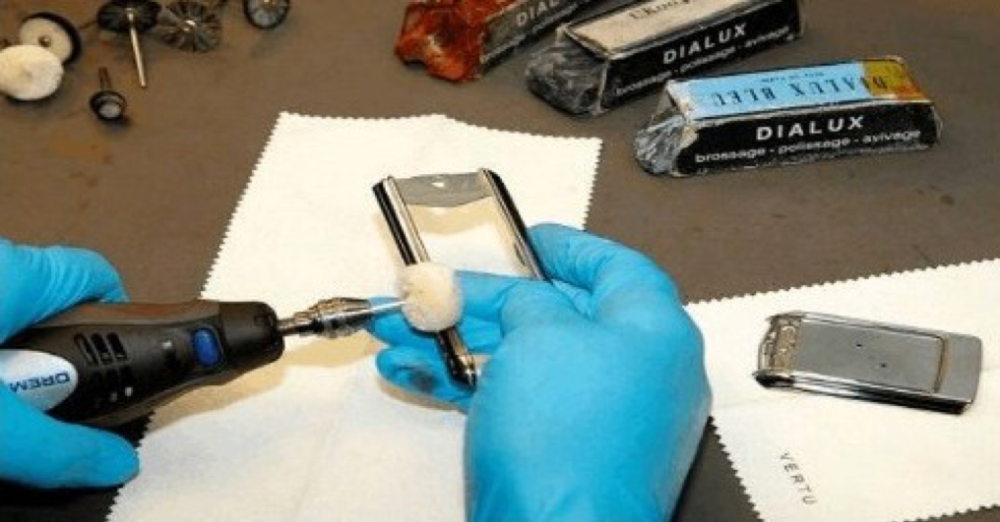
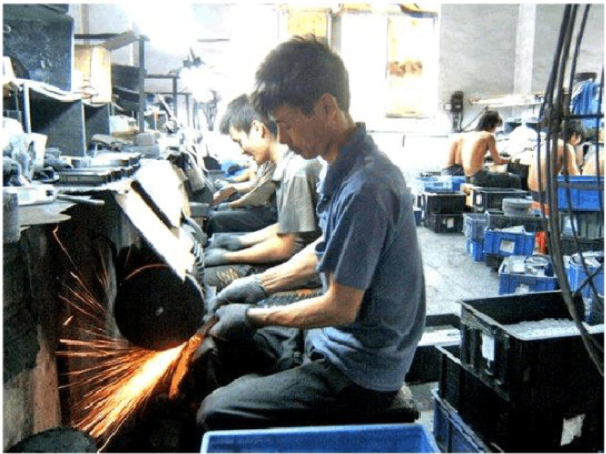
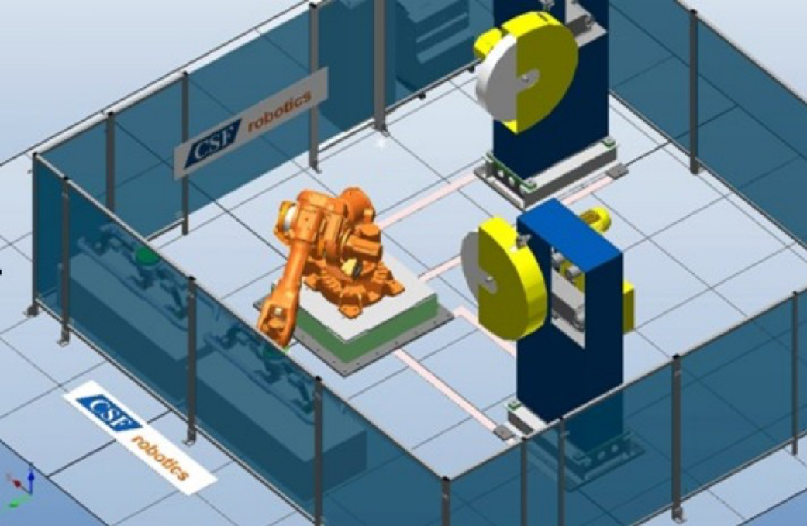
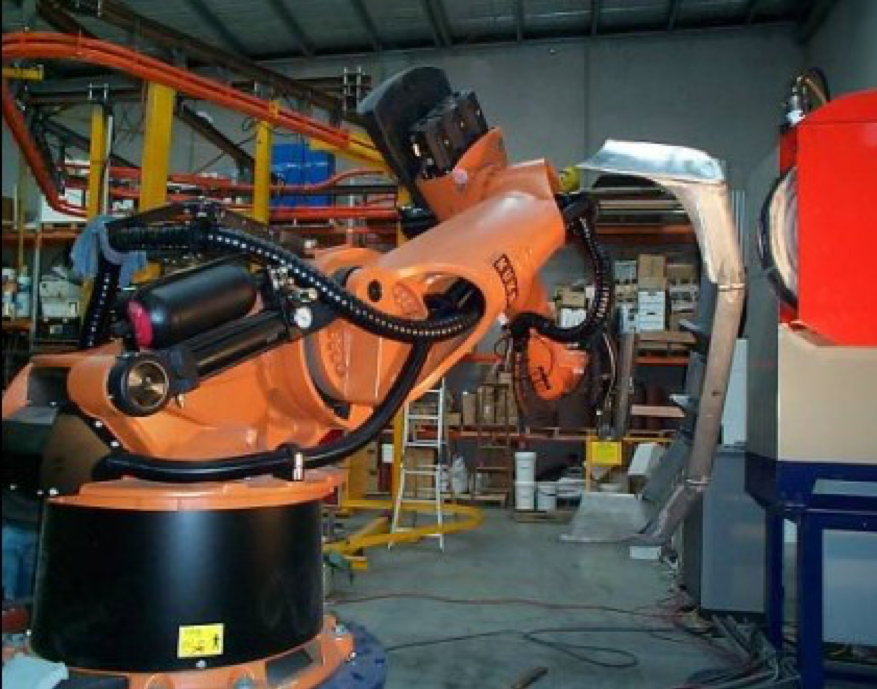

# 打磨机器人

## 什么叫打磨机器人

打磨机器人是从事打磨的工业机器人。打磨机器人，主要由工业机器人本体和打磨机具、抓手等外围设备组成，通过系统集成，由总控制电柜将机器人和外围设备的软硬件连接起来，统一协调，实现各种打磨功能。机器人打磨主要有两种方式：一种是通过机器人末端执行器夹持打磨工具，主动接触工件，工件相对固定不动，因此这种打磨机器人可称为工具主动型打磨机器人；另一种是机器人末端执行器夹持工件，通过工件贴近接触去毛刺机具设备，机具设备相对固定不动，因此这种打磨机器人也称为工件主动打磨机器人。

打磨机器人的基座和执行机构，包括臂部、腕部和手部，还包括行走机构。打磨机器人系统集成一般采用6轴机器人，机器人有6个自由度，因此工业机器人有类似人的行走腰转，大臂小臂伸缩，手腕旋转，手爪夹持等功能。

打磨机器人的第1关节实现末端执行器前后移动，第2关节实现末端执行器的左右移动，第3关节实现末端执行器的上下移动，第4-6关节实现末端执行器的姿态调整。这样打磨机器人就可以像人一样通过变换身体和手腕姿态，完成一系列的打磨工作。

打磨机器人控制系统能按照输入程序对驱动系统和执行机构发出指令信号、进行控制。因此打磨机器人通过示教和离线编程，控制打磨机器人位置、腰部姿态、腕部角度和爪手位置，充分满足各类工件的不同部位，完成打磨、抛光、去毛刺的各种工艺加工。

## 人工打磨缺点

人工打磨就是通过人手把握打磨工具完成工件打磨、抛光、去毛刺加工；或者人手把握工件在打磨机具上完成打磨、抛光、去毛刺加工。因此人工打磨不可避免地存在以下问题：

1. 人工打磨产生的火花、粉尘及噪声造成环境污染，严重影响工人身心健康。

2. 随着我国工人工资不断上升，而且恶劣的工作环境必须支付工人更多的薪酬，这样就会使生产成本不断抬高，企业盈利水平不断下降。

3. 人工打磨质量要依照工人经验去判断人为的因素，使打磨质量无法得到保证。

4. 工人无法长时间集中精力从事紧张重复劳动，因此容易发生工伤事故。

5. 熟练工的缺失，工效低下。
 
人工手动打磨手机外壳作业图示:

 
传统人工手持工件在砂轮机上打磨抛光作业:

## 打磨机器人优点

机器人替代人工，完成各种打磨工作，充分体现了打磨机器人的优越性。

1. 机器人替代熟练工，不但降低人力成本，而且也不会因为操作工的流失而影响交货期。

2. 机器人可以长时间连续加工，与人工相比，生产效率大幅提高。

3. 机器人能保持产品加工高度的一致性，不仅使质量有了可靠的保证，而且降低废品率。

4. 操作工不直接接触危险的加工设备，避免工伤事故的发生。

5. 密闭式的机器人工作站，将高噪音和金属粉尘与外部隔离，减少环境污染，做到文明生产。

## 打磨机器人的多功能、多用途

配置刀库的工具夹持型打磨机器人，打磨机器人的末端执行器可以连接不同打磨工具，根据生产需要，通过调换不同刀具、磨具，可以分别完成切割、铣削、打磨、抛光等不同工艺工序加工，对于工件夹持型打磨机器人，通过配置不同爪手来夹持工件，机器人可以一次夹持工件分别在砂带、砂轮、抛光机以及装有铣削刀具等不同的机加工设备上，完成打磨、抛光、去毛刺的全部加工。

机器人夹持工件在砂轮机上打磨抛光:

