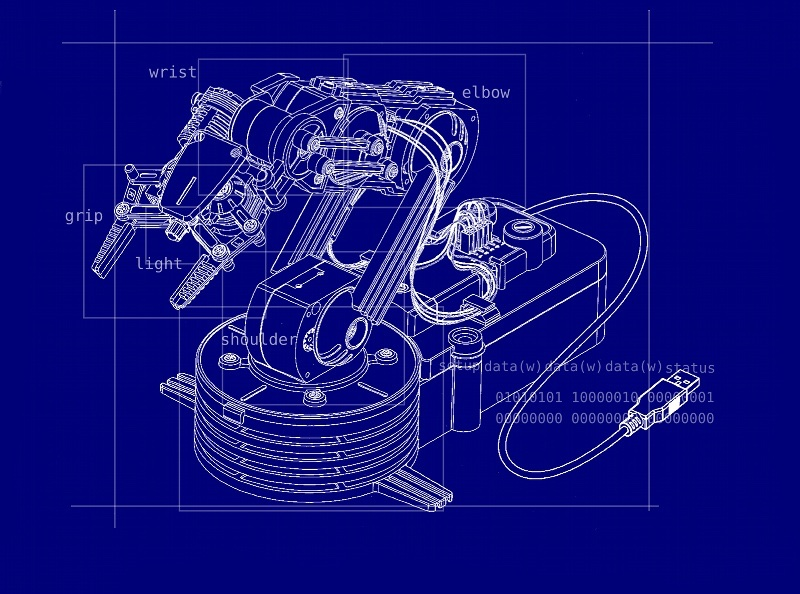
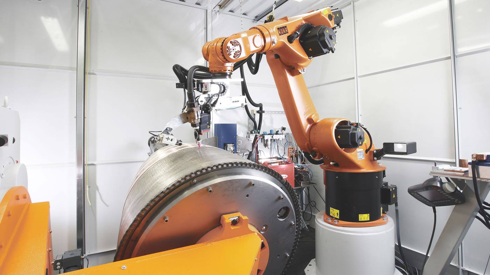

# 自动化板管弧焊机器人系统集成

## 方案概述

弧焊技术是现代焊接技术的重要组成部分，其应用范围几乎涵盖了所有的焊接生产领域。于传统人工弧焊相比，发那科机器人焊接系统作业克服了焊缝不稳定、焊接质量差、工作效率低、对人体伤害大等缺点。并集提高焊接生产率、保证焊接质量、实现焊接生产自动化和智能化优点于一身而得到焊接生产企业的日益重视。FANUC发那科板管弧焊机器人系统集成集成产品在整车焊接包括车身底板及车体内部等的焊接中广泛运用。

发那科弧焊机器人系统集成产品包括发那科机器人管材焊接系统集成，发那科激光焊接机器人系统集成，发那科机器人铝合金焊接系统，发那科机器人不锈钢管焊接系统，发那科机器人冷丝薄板焊接系统，发那科机器人不锈钢板焊接系统，发那科铝制容器/铝制器焊接机器人系统，发那科机器人输油管焊接系统，发那科机器人自行车架焊接，发那科航空材料焊接机器人工作站，发那科板管弧焊机器人系统集成，发那科激光焊接机械手工作站，FANUC搬运机器人工作站，发那科切割机器人集成工作站，发那科码垛机械手工作站等系统集成；

## 系统硬件构成

发那科板管弧焊机器人系统集成硬件主要由弧焊机器人、PLC、焊机系统、清枪器和安全控制系统组成。PLC与机器人之问采用PROFIBUS-DP通信方式进行信号交换，实现PLC对机器人的控制。机器人与弧焊机控制器之间采用DEVICENET通信方式进行数据交换，实现了机器人对弧焊机的控制机及弧焊机参数的设置。

1. PLC: 采用西门子S7400系列CPU414-2DPPLC，该PLC为西门子高端PLC,CPU处理速度快，通信能力强，适用于大型控制系统。PLC采用PROEIBUS-DP网路通讯实现分布式控制。PLC通过读取外部信号状态进行逻辑处理，驱动电磁阀动作，控制液压站的起停、控制弧焊机器人的自动运行。PLC就像联络员，把夹具、机器人、液压站、清枪器等设备一协调起来，实现有序的自动化工作。

2. 机器人: 可以采用FANUC公司ARC Mate 100iB型弧焊机器人，控制系统选用高性能的焊接机器人FANUC SYSTEM R-30iA控制系统。该机器人工作半径1687mm,腕部负载6kg，重复精度 士0.08，确保了焊缝位置的精确空制。此外还可以采用发那科机器人的其他型号包括M-10iA M-10iA/10S M-10iA/6L M-20iA M-20iA/10LM-20iA/20T M-710iC/20L等。

3. 传感器外围输人信一号如夹具油缸位置检测信号、按钮信号等，输人给PLC。

4. 液压站: 采用油泵为动力输出，液压油为媒介，驱动油缸的运动。

5. 电磁阀: 由PLC输出点控制其线圈通断，达到阀体换向，从而控制油缸动作方向的控制元件。

6. 焊机系统: 焊机系统主要由焊接电源、送丝机、焊枪组成。协议进行通信，这是一种在工业应用中处于领先地位的系统集成。该系统采用数字化通信协议，所有焊接参数、工艺控制等操作仅通过机器人的示教器即可完成，同时还能进行设备的故障诊断等。

## 系统集成特点

1. 提高了发现和处理故障的能力。当电源处于待机状态和出现故障时可直接通过机器人示教器和其控制柜上的以太网接口来处理解决。

2. 紧凑集成的组装。通过简单的内部连接，使焊接电源和机器人的控制柜共用一根输人电缆。

3. 焊接参数完全由Fanuc机器人示教器控制。Power Wave F355i内置的焊接程序数据库，能很容易少也从机器人示教器中进行存取。

4. 机器人控制器的以太网连接通信。通过联网的个人电脑能进行遥控检测、修改、排除故障和焊接电源软件的升级。

5. FANUC发那科板管弧焊机器人系统集成能进行焊接模式的选择。如:预送气、起弧前送丝速度、电弧控制、回烧、滞后断气及收弧等。这使得操作人员能很好的控制焊接工艺及程序。

6. 焊接参数的协调控制。不需要单独设置送丝速度和电压，它能自动根据所设定的送丝速度来设置电压和脉冲等特性。

7. Power wave电源具有一个很大的焊接程序或称为焊接模式的数据库。每个焊接模式是一个特定软件程序，用于确定焊接电源的输出特性。这些焊接模式被开发应用于很广的范围，它们可以通过具体的焊丝型号、焊丝直径、保护气体类型或实际应用来确定。

## 应用效果

Fanuc弧焊机器人焊接系统应用于车架焊接以后，工作效率提高，机器人轨迹运行速度最大可达2000mm/S，焊接速度最大可达35mm/s。在车架焊接参数中，经过反复调试，充分考虑焊接效率和焊接质量因素，采用6～15mm/s焊接速度。使用弧焊机器人焊接，焊缝质量可靠，工作效率稳定。与人工焊接相比，有效避免了因人工技能、心情等因素造成的焊接质量、生产效率问题。

更多发那科板管弧焊机器人系统集成关于焊接，码垛，搬运，装配，上下料，抛光打磨，切割，浇铸，冲压等方面详情欢迎来电垂询广州米多机器人有限公司。我们不仅在机器人自动化系统集成方面技术全面，经验丰富，而且能快速，多方面、全面位地解决企业生产的后顾之忧，为企业节约劳动成本，提高生产效率创造得力条件。