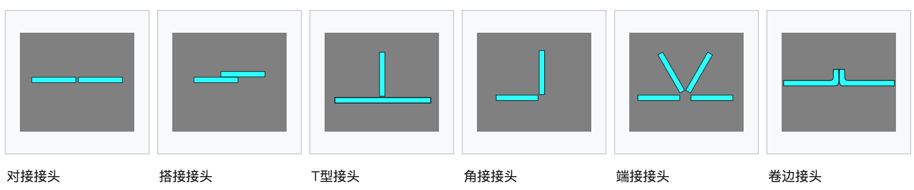

# 弧焊工艺技术简介

## 焊接工艺

### 电弧焊接

弧焊使用焊接电源来创造并维持电极和焊接材料之间的电弧，使焊点上的金属融化形成熔池。它们可以使用直流电或交流电，使用消耗性或非消耗性电极。有时在熔池附近会引入某种惰性或半惰性气体，即保护气体，有时还会添加焊补材料。

#### 能量工艺

弧焊过程要消耗大量的电能，可以通过多种焊接电源来供应能量。最常见的焊接电源包括恒流电源和恒压电源。在弧焊过程中，所施加的电压决定电弧的长度，所输入的电流则决定输出的热量。恒流电源输出恒定的电流和波动的电压，多用于人工焊接，如手工电弧焊和钨极气体保护电弧焊。因为人工焊接要求电流保持相对稳定，而在实际操作中，电极的位置很难保证不变，弧长和电压也会随之发生变化。恒压电源输出恒定的电压和波动的电流，因此常用于自动焊接工艺，如熔化极气体保护电弧焊、药芯焊丝电弧焊和埋弧焊。在这些焊接工艺中中，电弧长度保持恒定，因为焊头和工件之间距离发生的任何波动都通过电流的变化来弥补。例如，如果焊头和工件的间隔过近，电流将急速增大，使得焊点处发热量骤增，焊头部分融化直至间隔恢复到原来的程度[13]。

所用的电的类型对焊接有很大影响。耗电量大的焊接工艺，如手工电弧焊和熔化极气体保护电弧焊通常使用直流电，电极可接正极或负极。在焊接中，接正极的部分会有更大的热量集中，因此，改变电极的极性将影响到焊接性能。如果是工件接正极，工件将更热，焊接深度和焊接速度也会大大提高。反之，工件接负极的话将焊出较浅的焊缝[14]。耗电量较小的焊接工艺，如钨极气体保护电弧焊，可以通直流电（采用任意接头方式），也可以使用交流电。然而，这些焊接工艺所采用的电极都是只产生电弧而不提供焊料的，因此在使用直流电时，接正电极的时候，焊接深度较浅，而接负电极时能产生更深的焊缝[15]。交流电使电极的极性迅速变化，从而将生成中等穿透程度的焊缝。使用交流电的缺点之一是，每一次变化的电压通过电压零点后，电弧必须重新点燃，为解决这一问题，一些特殊的焊接电源产生的是方波型的交流电，而不是通常的正弦波型，使得电压变化通过零点时的负面影响降到最小[16]。

#### 弧焊工艺

手工电弧焊最常见的焊接工艺。在焊接材料和消耗性的焊条之间，通过施加高电压来形成电弧，焊条的芯部分通常由钢制成，外层包覆有一层助焊剂。在焊接过程中，助焊剂燃烧产生二氧化碳，保护焊缝区免受氧化和污染。电极芯则直接充当填充材料，不需要另外添加焊料。

这种工艺的适应面很广，所需的设备也相对便宜，非常适合现场和户外作业[17]。操作者只需接受少量的培训便可熟练掌握。焊接时间较慢，因为消耗性的焊条电极必须经常更换。焊接后还需要清除助焊剂形成的焊渣[18]。此外，这一技术通常只用于焊接黑色金属，焊铸铁、镍、铝、铜等金属时需要使用特殊焊条。缺乏经验的操作者还往往难以掌握特殊位置的焊接。

熔化极气体保护电弧焊，通常包含MIG（又称为金属-惰性气体焊）及MAG（又称为金属-活性气体焊），是一种半自动或自动的焊接工艺。它采用焊条连续送丝作为电极，并用惰性、半惰性或活性气体，以及混合气体保护焊点。和手工电弧焊相似，操作者稍加培训就能熟练掌握。由于焊丝供应是连续的，熔化极气体保护电弧焊和手工电弧焊相比能获得更高的焊接速度。此外，因其电弧相对手工电弧焊较小，熔化极气体保护电弧焊更适合进行特殊位置焊接（如仰焊）。

和手工电弧焊相比，熔化极气体保护电弧焊所需的设备要复杂和昂贵得多，安装过程也比较繁琐。因此，熔化极气体保护电弧焊的便携性和通用性并不好，而且由于必须使用保护气体，并不是特别适合于户外作业。但是，熔化极气体保护电弧焊的焊接速度较快，非常适合工厂化大规模焊接。这一工艺适用于多种金属，包括黑色和有色金属[19]。

另一种相似的技术是药芯焊丝电弧焊，它使用和熔化极气体保护电弧焊相似的设备，但采用包覆着粉末材料的钢质电极芯的焊丝。和标准的实心焊丝相比，这种焊丝更加昂贵，在焊接中会产生烟和焊渣，但使用它可以获得更高的焊接速度和更大的焊深[20]。

钨极气体保护电弧焊，或称钨-惰性气体（TIG焊）焊接（有时误称为氦弧焊），是一种手工焊接工艺。它采用非消耗性的钨电极，惰性或半惰性的保护气体，以及额外的焊料。这种工艺拥有稳定的电弧和较高的焊接质量，特别适用于焊接板料，但这一工艺对操作者的要求较高，焊接速度相对较低。

钨极气体保护电弧焊几乎适用于所有的可焊金属，最常用于焊接不锈钢和轻金属。它往往用于焊接那些对焊接质量要求较高的产品，如自行车、飞机和海上作业工具[21]。与之类似的是等离子弧焊，它采用钨电极和等离子气体来生成电弧。等离子弧焊的电弧相对于钨极气体保护电弧焊更集中，使对等离子弧焊的横向控制显得尤为重要，因此这一技术对机械系统的要求较高。由于其电流较稳定，该方法与钨极气体保护电弧焊相比，焊深更大，焊接速度更快。它能够焊接钨极气体保护电弧焊所能焊接的几乎所有金属，唯一不能焊接的是镁。不锈钢自动焊接是等离子弧焊的重要应用。该工艺的一种变种是等离子切割，适用于钢的切割[22]。

埋弧焊，是一种高效率的焊接工艺。埋弧焊的电弧是在助焊剂内部生成的，由于助焊剂阻隔了大气的影响，焊接质量因此得以大大提升。埋弧焊的焊渣往往能够自行脱落，无需清理焊渣。埋弧焊可以通过采用自动送丝装置来实现自动焊接，这样可以获得极高的焊接速度。由于电弧隐藏在助焊剂之下，几乎不产生烟雾，埋弧焊的工作环境大大好于其他弧焊工艺。这一工艺常用于工业生产，尤其是在制造大型产品和压力容器时[23]。其他的弧焊工艺包括原子氢焊、碳弧焊、电渣焊、气电焊、螺柱焊接等。

### 气焊

最常见的气焊工艺是可燃气焊接，也称为氧乙炔焰焊接。它是最古老，最通用的焊接工艺之一，但近年来在工业生产中已经不多见。它仍广泛用于制造和维修管道，也适用于制造某些类型的金属艺术品。可燃气焊接不仅可以用于焊接铁或钢，还可用于铜焊、钎焊、加热金属（以便弯曲成型）、气焰切割等。

可燃气焊接所需的设备较简单，也相对便宜，一般通过氧气和乙炔混合燃烧来产生温度约为3100摄氏度的火焰。因为火焰相对电弧更分散，可燃气焊接的焊缝冷却速度较慢，可能会导致更大的应力残留和焊接变形，但这一特性简化了高合金钢的焊接。一种衍生的应用被称为气焰切割，即用气体火焰来切割金属[6]。其他的气焊工艺有空气乙炔焊、氧氢焊、气压焊，它们的区别主要在于使用不同的燃料气体。氢氧焊有时用于小物品的精密焊接，如珠宝首饰。气焊也可用于焊接塑料，一般采用加热空气来焊接塑料，其工作温度比焊接金属要低得多。

### 电阻焊

电阻焊的原理是：两个或多个金属表面接触时，接触面上会产生接触电阻。如果在这些金属中通过较大的电流（1,000—100,000安培），根据焦耳定律，接触电阻大的部分会发热，将接触点附近的金属熔化形成熔池。一般来说，电阻焊是一种高效、无污染的焊接工艺，但其应用因为设备成本的问题受到限制。

点焊机
点焊，或称电阻点焊，是一种流行的电阻焊工艺，用于连接叠压在一起的金属板，金属板的厚度可达3毫米。两个电极在固定金属板的同时，还向金属板输送强电流。该方法的优点包括：能源利用效率较高，工件变形小，焊接速度快，易于实现自动化焊接，而且无需焊料。由于电阻点焊的焊缝强度明显较低，这一工艺只适合于制造某些产品。它广泛应用于汽车制造业，一辆普通汽车上由工业机器人进行的焊接点多达几千处。一种特殊的点焊工艺可用于不锈钢上。

与点焊类似的一种焊接工艺称为缝焊，它通过电极施加压力和电流来拼接金属板。缝焊所采用的电极是轧辊形而非点形，电极可以滚动来输送金属板，这使得缝焊能够制造较长的焊缝。在过去，这种工艺被用于制造易拉罐，但现在已经很少使用。其他的电阻焊工艺包括闪光焊、凸焊、对焊等[24]。

## 接头形式

五种基本接头类型分别是：对接接头、搭接接头、角接接头、端接接头、T形接头[29]。通常情况下，某些焊接工艺不能或几乎完全不能加工某些类型的接头。例如，电阻点焊、激光焊和电子束焊时常常采用搭接接头。然而，一些焊接工艺，如手工电弧焊，几乎可以采用任何接头类型。值得一提的是，有些焊接工艺允许进行多次焊接：在一次焊接的焊缝冷却之后，在其基础上再焊一次。这样就能够以V形对接接头来焊接较厚的工件[30]。

焊件的待焊部位加工成的具有一定几何形状的沟槽称为坡口。开坡口的目的是为了保证焊缝根部焊透，便于清除熔渣，获得较好的焊缝成形，保证焊接质量和连接强度，同时调整基本金属与填充金属比例。例如双V形对接制备接头，它的特点是把两个待连接的材料都切屑成V型尖角形状。单U型和双U型对接制备接头也很常见，它们的接头被加工成曲线状的U形，和V形接头的直线型不同，搭接接头可以用来连接两件以上的材料，这取决于焊接工艺和材料的厚度，一个搭接接头可以焊接多个工件

| 坡口/接头种类 | 英文 | 母料厚度 | 备注 |
| --- | --- | --- | --- |
| I形坡口 | Square | ≤15mm | 必要时加衬垫 |
| 单边V形坡口 | Single-bevel | 3< t ≤10 mm | 无 |
| K形坡口 |	Double-bevel | >10 mm | 无 |
| V形坡口 | Single-V | 3< t ≤12 mm | 无 |

## 焊接质量

衡量焊接质量的主要指标是焊点及其周边材料的强度。影响强度的因素很多，包括焊接工艺、能量的注入形式、母材、填充材料、助焊剂、接头设计形式，以及上述因素间的相互作用。通常采用有损或无损检测来检查焊接质量，检测的主要对象是焊点的缺陷、残余应力和变形的程度、热影响区的性质。焊接检测有一整套规范和标准，来指导操作者采用适当的焊接工艺并判断焊接质量。

### 热影响区

焊接工艺对焊缝附近的金属特性的影响是可以标定的，不同焊接材料和焊接工艺会形成大小不一、特性各异的热影响区。母材的热扩散系数对热影响区的性质有很大的影响：较大的热扩散系数使得材料能以较快速度冷却，形成相对较小的热影响区。与之相反的是，如果材料的热扩散系数较小，散热困难，热影响区相对就较大。焊接工艺的热能输入量对热影响区也有显著的影响，如氧乙炔焊接中，由于热量不是集中输入的，会形成较大的热影响区。而诸如激光焊接这样的工艺，能够把有限的热量集中输出，所造成的热影响区较小。弧焊所造成的热影响区则位于两种极端情况之间，操作者水平往往决定了弧焊热影响区的大小[34][35]。

### 扭曲和断裂

由于焊接时金属被加热到熔化温度，它们在冷却时会产生收缩。收缩会产生残余应力，并造成纵向和圆周方向的扭曲。扭曲可能导致产品形状的失控。为了消除扭曲，有时焊接时会引入一定的偏移量，以抵消冷却造成的扭曲[37]。限制扭曲的其他方法包括将工件夹紧，但是这样可能导致热影响区残余应力的增大。残余应力会降低母材的机械性能，形成灾难性的冷裂纹。第二次世界大战期间建造的多艘自由轮就出现过这种问题[38][39]。冷裂纹仅见于钢材料，它与钢冷却时形成马氏体有关，断裂多发生在母材的热影响区。为了减少扭曲和残余应力，应该控制焊接的热输入量，单个材料上的焊接应该一次完工，而不是分多次进行。

其他类型的裂纹，如热裂纹和硬化裂纹，在所有金属的焊接熔化区都可能出现。为了减少裂纹的出现，金属焊接时不应施加外力约束，并采用适当的助焊剂[40]。

## 可焊性

### 钢铁

不同钢铁材料的可焊性与其本身的硬化特性成反比，硬化特性指的是钢铁焊接后冷却期间产生马氏体的能力。钢铁的硬化特性取决于它的化学成分，如果一块钢材料含有较高比例的碳和其他合金元素，它的硬化特性指标就较高，因此可焊性相对较低。要比较不同合金钢的可焊性，可以采用以一种名为当量碳含量的方法，它可以反映出不同合金钢相对于普通碳钢的可焊性。例如，铬和钒对可焊性的影响要比铜和镍高，而以上合金元素的影响因子比碳都要小。合金钢的当量碳含量越高，其可焊性就越低。如果为了取得较高的可焊性而采用普通碳钢和低合金钢的话，产品的强度就相对较低——可焊性和产品强度之间存在着微妙的权衡关系。1970年代开发出的高强度低合金钢则克服了强度和可焊性之间的矛盾，这些合金钢在拥有高强度的同时也有很好的可焊性，使得它们成为焊接应用的理想材料[41]。

由于不锈钢含有较高比例的铬，所以对它的可焊性的分析不同于其他钢材。不锈钢中的奥氏体具有较好的可焊性，但是奥氏体因其较高的热膨胀系数而对扭曲十分敏感。一些奥氏体不锈钢合金容易断裂，因此降低了它们的抗腐蚀性能。如果在焊接中不注意控制铁素体的生成，就可能导致热断裂。为了解决这个问题，可以采用一只额外的电极头，用来沉积一种含有少量铁素体的焊缝金属。铁素体不锈钢和马氏体不锈钢的可焊性也不好，在焊接中必须要预热，并用特殊焊接电极来焊接[42]。

### 铝

铝合金的可焊性随着其所含合金元素的不同变化很大。铝合金对热断裂的敏感度很高，因此在焊接时通常采用高焊接速度、低热输入的方法。预热可以降低焊接区域的温度梯度，从而减少热断裂。但是预热也会降低母材的机械性能，并且不能在母材固定时施加。采用适当的接头形式、兼容性更好的填充合金都能减少热断裂的出现。铝合金在焊接之前应清理表面，除去氧化物、油污和松散的杂质。表面清理是非常重要的，因为铝合金焊接时，过多的氢会造成泡沫化，过多的氧会形成浮渣[43]。