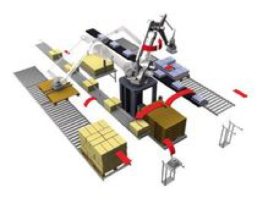
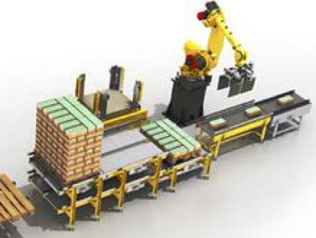

# 案例说明

## 仓库码垛

一个用来建造随机货盘的机器人能集成进工厂的仓库管理系统（WMS）。理想上，它会成为WMS的前段，与仓库软件一起协调工作，来生产混合货盘。
精密的软件同样能够满足对立即可上架货盘的需求。一般来说，这就意味着产品码垛好后，部分或者全部一次包装容器的标签都必须是朝外的。 

## 冷冻仓库码垛
机器人码垛设备还是另外一个苛刻应用的选择：冷冻仓库内码垛。在消费商品包装领域，在一个冷冻仓库内处理箱子是最困难的工作之一。工人们不得不频繁地交替工作来保持身体暖和，这就间接的降低了工作效率并提高了劳动力成本。
 

在冰冻环境下，自动化的随机存取式码垛机并不是正确选择，因为大多数自动化随机存取码垛机都使用在冷库里会结冰的压缩空气管。而与自动化码垛机相比，码垛机器人的尺寸更紧凑，由于冷冻仓库中的空间十分宝贵，因此这点显得尤为重要。尽管如此，机器人在冷冻仓库中的应用也存在着一些问题。一些供应商开始为冷冻仓库设计特殊的码垛机器人。

## 真空抓手

在采用码垛机器人的时候，还要考虑一个重要的事情，就是机器人怎样抓住一个产品。 真空抓手是最常见的机械臂臂端工具（EOAT）。相对来说，它们价格便宜，易于操作，而且能够有效装载大部分负载物。但是在一些特定的应用中，真空抓手也会遇到问题，例如表面多孔的基质，内容物为液体的软包装，或者表面不平整的包装等等。

其他的EOAT选择包括翻盖式抓手，它能将一个袋子或者其他包装形式的两边夹住；叉子式抓手，它插入包装的底部来将包装提升起来；还有袋子式抓手，这是翻盖式和叉子式抓手的混合体，它的叉子部分能包裹住包装的底部和两边。
将基本EOAT类型进行其他的组合也是可以的。一个饮料包装商在对装满瓶子，并且收缩裹包好的瓦楞托盘进行码垛时碰到了困难，真空吸盘会把托盘上的薄膜扯下来。
