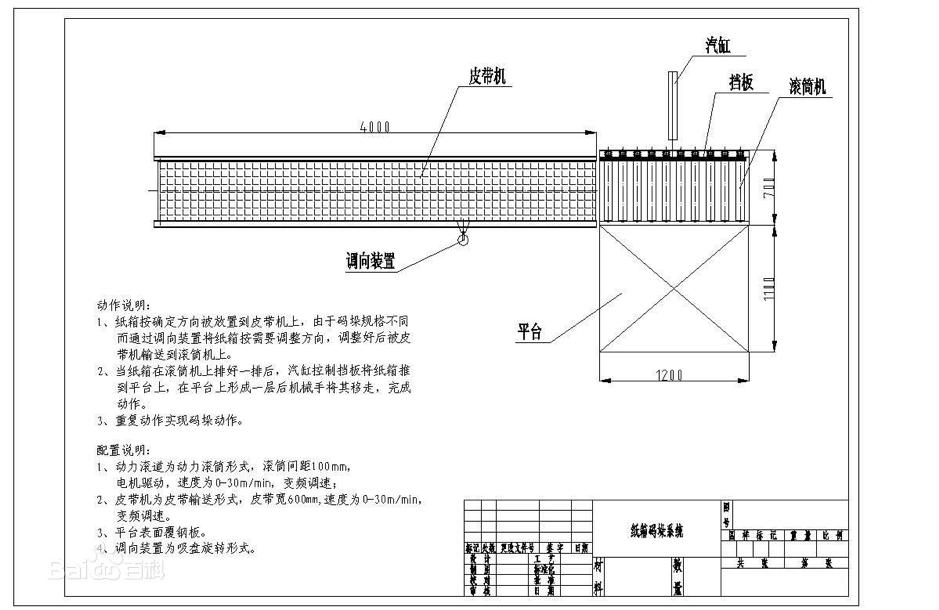
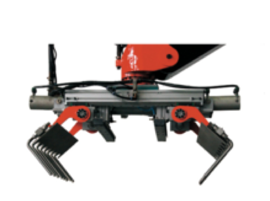

# 关键工艺

## 生产线

在工人完成产品的装箱后，进入输送线1，产品输送到封箱机中，然后经过输送线2，在2号线中有一个定位装置也可称定位挡板（已在娃哈哈生产线上成功应用），此装置和定位板可以完成箱体的旋转和定位，可以让箱体靠左侧定位，然后输送到缓冲区1，缓冲区有一个助推装置，此装置可以将箱体合适的输送到空闲的空间，在将装满的托盘推动动缓冲区2。缓冲区上方为码跺机器人，机器人通过机械手吸盘将15个箱子（小袋装可以码15个，盒装和听装可以码8-10个）整体提升垂直提升，在水平运行，以躲避安全通道，宽度和高度均为2米，经过安全通道后垂直放置在码跺区，前面的定位挡板已经将箱体旋转，所以机械手不需要旋转，在放置完成后，按照原路径返回，码跺区完成10层码跺后，由叉车将其叉走，在放置空闲码盘。前面的缓冲区2码盘在箱体被移走后为空盘，由人工移走再等缓冲区1码盘运送过来的时候放置在缓冲区1即可。
系统还设有紧急停止按扭，可手动、自动停止；机器人支承架工作范围内装有光栅安全系统，在故障或异常情况下报警信号灯亮，系统紧急停止，在手动状态下排除报警后系统方可继续运行；有自动记忆功能，在停电或故障情况后可继续完成工作。

输送线图纸如下:

 

## 运行效率

按照客户提供的封箱时间15箱/分钟，如果一个一个抓取箱体需要4秒一个运行周期，完成产品的提升，输送，放置在按照路径返回，由于下方是行走区域所以不能应用导轨的差补运动，只能走直线路程。要使用这样的工作速度没有完成的可能行，而且很不安全，按照箱体整体运送的方式，按照一个箱体输送过来开始计算，一个码盘装满需要60秒，在这60秒（另外两个可以有32秒-40秒，可以码8-10个），完成助推，抓取提升，输送，放置和返回有充足的时间。
以上为箱体包装的产品输送方式，具体过程请参看效果图。
大袋产品的生产周期为15秒/袋，所以直接完成单个码跺输送，时间也很充足，主要是负载不大，所以可以提高运行速率。

## 技术参数

MD-25T 堆码机器人

1. 功率: 三相，5KW,380V,50HZ/60Hz

2. 气压: 3~6公斤/每平方厘米

3. 速度: 25箱/分钟

 
对于随机货盘来说，码垛机器人是唯一的选择。尽管如此，机器人装载也面临比较多的问题，如果要以较高的速度进行生产，将更加困难重重。
一个处理随机装载的机器人码垛机需要特殊的软件，通过软件，机器人码垛机与生产线的其他部分相连接，这是个巨大的进步。
